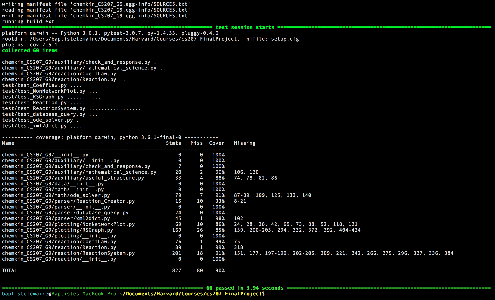

[](https://travis-ci.org/cs207group9/cs207-FinalProject.svg?branch=master)

[](https://coveralls.io/github/cs207group9/cs207-FinalProject?branch=master&service=github)


# CS207 Final Project - Chemical Kinetics Module - Group 9

This is the repository for the CS207 project for chemical kinetics.

Group 9: Camilo Fosco, Baptiste Lemaire, Jiejun Lu, Yiqi Xie

## Problem Solving

This project aims to derive and evalutate the evolutionary equation for a set of M chemical reactions involving N species. The reactions are of the form: 

<p align="center">
  
</p>

where  represents the species,  is the stoichiometric coefficient matrix for reactants, and 
 is the stoichiometric matrix for products. Here we put a double sided arrow in between to indicate that in general we allow the reactions to be reversible. 

To calculate the reaction rates, we use the following formula:
<p align="center">
  
</p>

This is also the equation of evolution. Here , the progress rate, is:
<p align="center">
  
</p>

`kf` and `kb` denote for the forward reaction rate coefficient and the backward reaction rate coefficient, respectively. Their ratio should be fixed as the equilibrium constant. For irreversible reactions, the equilibrium constant is theoretically very large so that one can mannually set `kb=0`. The forward coefficient `kf` can be obtained in multiple ways. Implemented forward coefficients are:
- Constant coefficient (`Constant`)
- Coefficient for Arrhenius reaction (`Arrhenius`)
- Coefficient for modified Arrhenius reaction (`modArrhenius`)

The equilibrium constant can be inferred from a set of NASA coefficients. Once we obtained the forward coefficient and the equilibrium constant, we have the backward coefficient, thus the specific equation of evolution.

Note that the relation between reaction rate `f` and concentration `x` turns out to be quite simple. We can derive their jacobian mannually if we want.

For practice, we built several classes to read in the reaction information and calculate the righthand side of the equation of evolution; we implemented some methods to solve the evolution numerically; and we also provided some easy-using interfaces for reaction visuallization.


## Required modules

To run this library, you will need to download and install (if not installed yet) the following modules:

```numpy, xml, sqlite3, copy, more_itertools, scipy, matplotlib, graphviz, moviepy, imageio, pydotplus``` .

You can download and install these modules by using the following commande:

`pip install MODULENAME`.

The `scipy` package needs to have `solve_ivp` method in its `integrate` module. To make sure, one'd better upgrade the package if (s)he already have it:

`pip install --upgrade scipy`

## Installing and Getting Started

One can download the package by using the following command:

`pip3 install chemkin_CS207_G9`

or

`pip install chemkin_CS207_G9`

However, we recommend that one downloads and installs the library from GitHub by entering the following commands:

`git clone https://github.com/cs207group9/cs207-FinalProject.git`  
`cd cs207-FinalProject`  
`python setup.py install`  


## Test Coverage

The fastest way to check the coverage of our library is to run the following commands in the terminal:

`git clone https://github.com/cs207group9/cs207-FinalProject.git`  
`cd cs207-FinalProject`  
`python setup.py test`  

As can be seen on the screenshot below, **our test coverage is 94%**.



## Basic Usage and Examples

Basic usage of this library starts with importing:
```
from chemkin_CS207_G9.reaction.Reaction import Reaction
from chemkin_CS207_G9.reaction.ReactionSystem import ReactionSystem
from chemkin_CS207_G9.parser.database_query import CoeffQuery
```

To calculate a reaction coefficient of a particular system, first we must create the ReactionSystem object that represents this system. ReactionSystem needs a list of Reaction objects and some related informations. Let's first create those essential ingredients:
```
# Some reactions involving species H2, O2, OH, HO2 and H2O
reaction1 = Reaction(
    reactants={'H2':2,'O2':1}, products = {'OH':2,'H2':1}, 
    coeffLaw = 'Constant', coeffParams = {'k':10}, 
    reversible='no')
reaction2 = Reaction(
    reactants={'OH':1,'HO2':1}, products = {'H2O':1,'O2':1}, 
    coeffLaw = 'Arrhenius', coeffParams = {'A':5, 'E':-10}, 
    reversible='yes')
reactions = [reaction1, reaction2]

# Species specified in order
species = ['H2', 'O2', 'OH', 'HO2', 'H2O']

# One concentration value is needed for each species of our reactions
concentrations = {'H2':1, 'O2':2, 'OH':2, 'HO2':1, 'H2O':1}

# And the temperature under which they react
temperature = 300

# Database connection object to the nasa coefficients
# (this is just an example, you should specify your own path to the file)
nasa_query = CoeffQuery('nasa_thermo_all.sqlite')
```
We can now create our ReactionSystem object:
```
rs = ReactionSystem(
    reactions, species, nasa_query, 
    initial_concs=concentrations, initial_T=temperature)
```
And call the get_reac_rate() function that returns the reaction rate value for each specie.
```
reac_rate = rs.get_reac_rate()
```
It is also possible to directly ask the system to evolute:
```
time_evolute = 1e-10
rs.evolute(time_evolute)
```
This calls the ode solvers to update the concentrations. The default solver is `LSODA` implemented in `scipy` library, and there are plenty of other options. The evolution progress can be monitored by applying:
```
rs.get_concs()
```
Furthermore, one may utlize the `chemkin_CS207_G9.plotting` module to get more insights into the reaction systems through quickly generated visualizations. Please refer to later sections for more details.

For most cases it would be much easier to import the reactions from other files instead of typing them in manually. We currently provide one method to allow users import from formatted `.xml` file:
```
from chemkin_CS207_G9.parser.xml2dict import xml2dict

# (this is just an example, you should specify your own path to the file)
species, reactions_info = xml2dict().parse('rxns_reversible.xml')
```
Now `species` is a list of species names, and `reactions_info` is another list of dictionary which can be used to create the `Reaction` objects:
```
reactions = [Reaction(**info) for info in reaction_info]
```

## Example Data
Along with the package there are two additional files of example data - one is `nasa_thermo_all.sqlite`, the database containing all the nasa coefficients, and the other is `rxns_reversible.xml`, the `.xml` file of some reactions and species. Users may access them by:
```
import os
import chemkin_CS207_G9
BASE_DIR = os.path.dirname(os.path.abspath(chemkin_CS207_G9.data.__file__))

path_xml = os.path.join(BASE_DIR, 'rxns_reversible.xml') # path to the .xml file
path_sql = os.path.join(BASE_DIR, 'nasa_thermo_all.sqlite')  # path to the .sqlite file
```
Then `path_xml` and `path_sql` can be fed to the above `xml2dict` object and `CoeffQuery` object directly.

# New Feature: Visualization
## Motivation and description of the feature
Our feature is a visualization module that allows the user to observe different species of a certain reaction system in multiple ways. The main feature of the module is a graph visualization of the current reaction system, created with graphviz.
We will also provide functions for concentration / reaction rate visualization over time. We will implement an ODE solver to compute the concentrations. The plots will have multiple parameters for user customization, such as log scale options, selection of one or multiple species, visualization of several curves on one graph, real time visualization, etc. 


## Implementation of Network Graph
`RSGraph` is a base class of network visualization, which have some common basic function for plotting and changing the style of graphs. The graph assigns a color to each equation (can be defined by the user) and can show the change of concentration of a given specie in the set of reactions by color of the node.
There are two types of graphs derived from the network visulization class `RSGraph`: `BipartiteRSGraph` and `HierarchicalRSGraph`.

We could plot the graph with function `plot`, and set the method as `jupyter` (shown in jupyter notebook directly), or to be opened in pdf and the path to saved.
```
graph.plot(method='jupyter',path="")
```

We would also like to change the settings of the graph, with function `modify_current_style` ,
```
graph.modify_current_style(style)
```
where input is a a dictionary with 3 sub-dictionaries: one for graph, one for nodes and one for edges.


`BipartiteRSGraph` is a bipartite graph of species and IDs of equation, which help us to recompute the reaction equations.
We construct a bipartite graph with species as nodes (u,1) in one side, and reactions as nodes (u,2) in another side.
Build directed edges (u,1) to (v,2) if edge u is the reactant of equation v.
Build directed edges (u,2) to (v,1) if edge v is the product of equation u.
Set edges to be dashed if the equation is reversible, otherwise filled.
From this graph, we could recompute the reaction equations.

<p align="center">
  
</p>

```
Example 1: Reaction System for Birpartite graph
#1: A + B = C
#2: C + D = A
#3: A + D = B
```

We initialize the  `BipartiteRSGraph` object by passing the  `ReactoinSystem` object in it, and plot the bipartite graph of the whole system using `plot_system`.
```
rs = ReactionSystem(reactions)
b_graph = BipartiteRSGraph(rs)
b_graph.plot_system(method='jupyter',path="")
```

`HierarchicalRSGraph` is a network graph with only species as nodes. The network of reactions can be plotted all at once or separately, with different grouping options and style options.
From this graph, we could have a basic understanding of the relationships among reactions.
Build undirected edges/line (u,v) if u and v are reactants in an equation.
Build directed dashed edges/arrow (u,v) if v is u’s product in an equation.  If it is reversible, then we use a double sided arrow.

<p align="center">
  
</p>

```
Example 2: Reaction for Hierarchical graph
A + B = C + D
```
We initialize the  `BipartiteRSGraph` object by passing the  `ReactoinSystem` object in it, and plot the hierarchical graph of the whole system using `plot_system`.
```
rs = ReactionSystem(reactions)
h_graph = HierarchicalRSGraph(rs)
h_graph.plot_system(method='jupyter',path="")
```
We could also plots individual graphs for each reaction in the ReactionSystem  `plot_reactions`.
```
h_graph.plot_reactions(method = 'jupyter', path = "RSGraph", idxs = [])
```
The variable `idxs` is a list of integers that allows the user to select specific reactions from the reaction system to plot.

There is another amazing feature: `save_evolution_mp4` generates and saves and mp4 with the evolution of the system on n timesteps, with an ODE step size defined by the user. 
```
save_evolution_mp4(solver_step_size = 1e-14, timesteps=5, path="HGRSVideo")
```

## Time Evolution
As shown in previous section, we have the `evolute` method to update the `ReactionSystem` through some time interval. The `evolute` method calculates the reaction rate and the corresponding jacobian automatically, and calls an ode solver to solve the evolution. A user may specify the solver explicitly, by default it is the `LSODA` method from `scipy` package:
```
rs.evolute(time_evolute, method='LSODA')
```
Other feasible `scipy` solvers are `Radau` and `BDF`. All of them are implicit methods. We also implemented a semi-implicit extrapolation method, `SIE`, as an option. We made this `SIE` stepsize adaptive, but in general `scipy` solvers are faster and stabler. For all the solvers, the default error tolerance is `1e-3` for relative error and `1e-6` for absolute error. There are also other common parameters like `max_step`, and users are free to adjust them with keywords. 

With the `evolution` method we can pass the `ReactionSystem` objects as the input arguments of evolution-plotting funtions. There are two functions of such kind, `plot_concentration` and `plot_reaction_rate`. Here is an example of their usage. First we load the `ReactionSystem` as usual:
```
from chemkin_CS207_G9.reaction.Reaction import Reaction
from chemkin_CS207_G9.reaction.ReactionSystem import ReactionSystem
from chemkin_CS207_G9.parser.xml2dict import xml2dict
from chemkin_CS207_G9.parser.database_query import CoeffQuery
import numpy as np

import os
import chemkin_CS207_G9
BASE_DIR = os.path.dirname(os.path.abspath(chemkin_CS207_G9.__file__))
path_xml = os.path.join(BASE_DIR, 'data/rxns_reversible.xml') # path to the .xml file
path_sql = os.path.join(BASE_DIR, 'data/nasa_thermo.sqlite')  # path to the .sqlite file

species, reactions_info = xml2dict().parse(path_xml).get_info()
reactions = [Reaction(**info) for info in reactions_info]
nasa_query = CoeffQuery(path_sql)

temperature = 3000
concentrations = dict(H=2, O=1, OH=0.5, H2=1, H2O=1, O2=1, HO2=0.5, H2O2=1)

rs = ReactionSystem(
    reactions, species, nasa_query, 
    initial_concs=concentrations, initial_T=temperature)
```
Then we plot with `rs`:
```
import numpy as np
import matplotlib.pyplot as plt
from chemkin_CS207_G9.plotting.NonNetworkPlot import plot_concentration
from chemkin_CS207_G9.plotting.NonNetworkPlot import plot_reaction_rate

time_grid = np.arange(0, 5e-14, 1e-15)
fig, axes = plt.subplots(2, 1, figsize=(8,12))
plot_concentration(
    reac_sys, time_grid, ax=axes[0], linestyle='dashed', 
    species=['H','O'], logscale=True)
plot_reaction_rate(
    reac_sys, time_grid, ax=axes[1], alpha=0.7)
plt.show()
```
<p align="center">
  
</p>

The functions generate the legends automatically. The users may specify the species of interest, the scale of the y-axis, and other plotting parameters of matplotlib curves.

## Modified Arrhenius Curves
We also provide a function to help visualize the shape of modifiefied Arrhenius curves in relation to `b`:
```
import numpy as np
import matplotlib.pyplot as plt
from chemkin_CS207_G9.plotting.NonNetworkPlot import plot_modified_arrhenius

T_grid = np.arange(0.01, 2, 0.01)
b_grid = np.arange(-2, 2, 1)
fig, ax = plt.subplots(figsize=(8,6))
plot_modified_arrhenius(T_grid, b_grid, ax=ax)
plt.show()
```
<p align="center">
  
</p>

# Organization

Our library is structured as followed:

``` 
chemkin_CS207_G9/
	__init__.py
	auxiliary/
		__init__.py
		check_and_response.py
		mathematical_science.py
		useful_structure.py
	data/
		__init__.py
		nasa_thermo_all.sqlite
		nasa_thermo.sqlite
		rxns_reversible.xml
	math/
		__init__.py
		ode_solver.py
	parser/
		__init__.py
		database_query.py
		xml2dict.py
	plotting/
		__init__.py
		NonNetworkPlot.py
		RSGraph.py
	reaction/
		__init__.py
		CoeffLaw.py
		Reaction.py
		ReactionSystem.py
						
```

# Contribution

We acknowledge that our version is perfectible and we strongly encourage our users to make new suggestions.

If a user wants to contribute to our package, contribution is possible by following these steps:

- Log into your GitHub account, and go to the chemkin_CS207_G9 page (https://github.com/cs207group9/cs207-FinalProject.git)  
- Click on the fork button (upper right corner) and choose your own repository.  
- Create a local copy of your fork of chemkin_CS207_G9 on your computer: on your fork page of chemkin_CS207_G9 on GitHub, 
click on the green button "Clone or download" and copy the link. On your terminal, enter the following command:  
```git clone CLONE_OR_DOWNLOAD_LINK```  
- Then get inside this new repo, enter the following command to keep up with the changes on the original chemkin_CS207_G9 repo:  
```git remote add chemkin_G9 git://github.com/cs207group9/cs207-FinalProject```    
- To make it explicit that the "origin" remote is actually your own fork repo, you are advised to enter the following command:  
```git remote rename origin your-user-name```    

Now, you are almost ready to work on your contribution:
- Fetch the latest changes made on chemkin_CS207_G9 on Github:  
```git fetch chemkin_G9```  
- Make a new feature branch, where you will actually make your suggestions of new changes:  
```git branch my-new-feature chemkin_G9/master```  
```git checkout my-new-feature```  
- Connect the branch to GitHub:  
```git push --set-upstream your-github-username my-new-feature```  
- Activate the development mode of chemkin_CS207_G9:  
```python setup.py develop```  

From now on, you can change the files inside your local repo, and you can even add new files. You should check that your changes do no
break the existing code. Add documentation to your code, but also add some tests for your code changes in order to maintain our
overall coverage over 75%. Commit your changes on git by entering the following commands:  
```git add .```    
```git commit -m "message-you-want-to-add"```  

And push your changes on GitHub:  
```git push```  

Last, you need to ask for your changes to be reviewed by our team (**Group 9** of the class **CS207**):  
- Go on the webpage of your fork of chemkin_CS207_G9 (e.g.: https://github.com/your-user-name/chemkin_CS207_G9).   
- Click on the "Branch:master" button ("Switch branches/tags", on the upper left corner of the page) and select 
your branch with your changes on it ("my-new-feature").    

<p align="center">
  
</p>

- Click on the "pull request" button to send us your suggestion of new changes. Please enter as many details as possible
(title, details of your changes, and reasons why you thought your changes were relevant).  


# Authors

* **Camilo Fosco**
[cfosco](https://github.com/cfosco)
* **Baptiste Lemaire**
[bjlemaire](https://github.com/bjlemaire)
* **Jiejun Lu**
[gwungwun](https://github.com/gwungwun)
* **Yiqi Xie**
[yiqixie94](https://github.com/yiqixie94)

See also the list of [contributors](https://github.com/cs207group9/cs207-FinalProject/pulse) who participated in this project.

## License

This project is licensed under the Harvard License.

## Acknowledgments

* David Sondak and the CS207 teaching staff.
